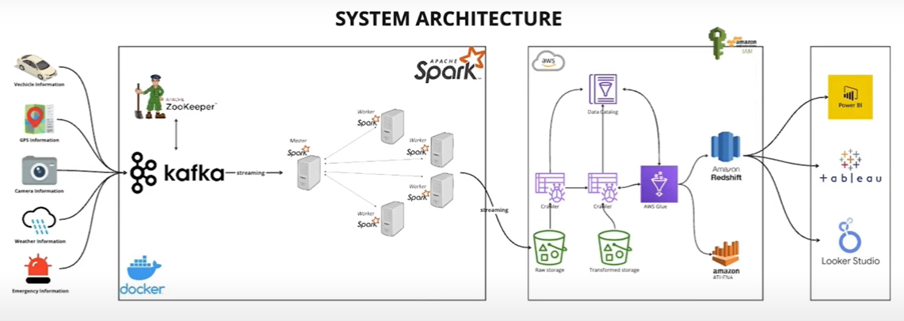
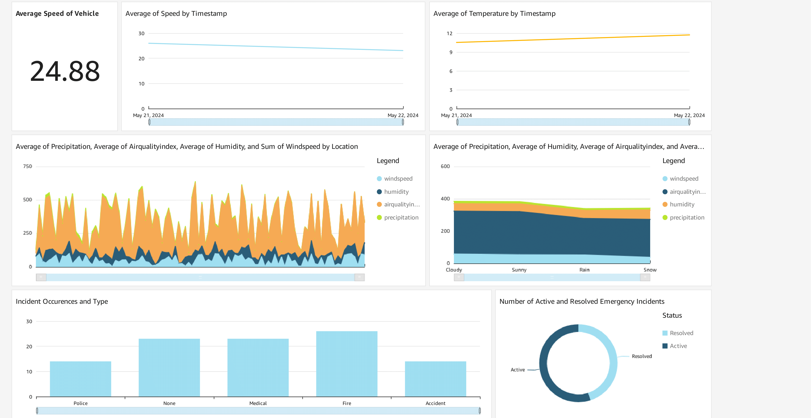
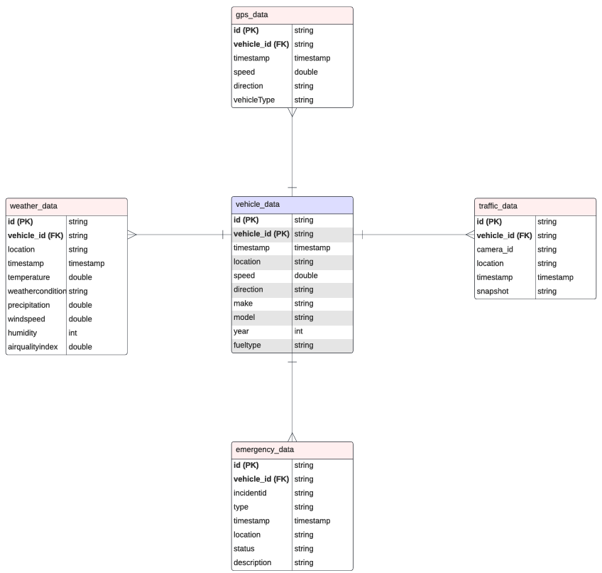

# Smart City End-to-End Real-Time Data Streaming Pipeline 🚦🏙️

This project implements a full real-time data engineering pipeline simulating a smart city environment. By integrating IoT devices, stream processing, and cloud services, the solution enables continuous monitoring and analysis of critical urban data — such as traffic flow, weather conditions, GPS locations, and emergency incidents — empowering city officials with real-time insights for smarter urban management.

---

## ⚙️ Key Features

- **Real-time data ingestion** from simulated IoT sensors
- **Kafka-based message streaming** with Docker orchestration
- **Spark Structured Streaming** for processing live data streams
- **AWS S3, Glue, Redshift, Athena, and QuickSight** for cloud storage, ETL, querying, and visualization
- **Dashboards** for vehicle telemetry, congestion, weather alerts, and emergency incidents


## 🔧 Technologies Used

| Category            | Tools / Services                                |
|---------------------|--------------------------------------------------|
| Ingestion           | Apache Kafka, Zookeeper, Docker                  |
| Stream Processing   | Apache Spark Structured Streaming, Python        |
| Storage             | AWS S3, AWS Glue, AWS Redshift                   |
| Querying            | AWS Athena                                       |
| Visualization       | Amazon QuickSight                                |
| Containerization    | Docker, Docker Compose                           |
| Others              | IAM Roles, Python scripts, Simulated IoT data    |


## 🧪 Use Case Scenario

The simulated use case involves a vehicle traveling between major cities while sending data like:

- Vehicle speed & telemetry
- GPS coordinates
- Weather reports
- Emergency incidents (accidents, alerts, hazards)

This pipeline processes, stores, and visualizes the data in near real-time — ideal for smart traffic management, public safety, and city infrastructure optimization.


### Prerequisites
- Docker & Docker Compose
- AWS account (with access to S3, Glue, Athena, Redshift, QuickSight)
- Python 3.8+
- AWS CLI configured


## 🔧 System Architecture

<p align="center">
  
  <br />
  <em>AWS, Spark, Kafka & Zookeeper solution architecture</em>
</p>

This project implements a robust, cloud-first architecture for processing real-time smart city data:

- Kafka & Zookeeper (Dockerized): Stream vehicle, GPS, camera, weather, and emergency data from IoT simulators.
- Apache Spark: Real-time stream processing with multiple worker nodes.

AWS Cloud Services:

- S3 for raw and transformed data storage.
- Glue & Crawlers for cataloging.
- Athena for serverless querying.
- Redshift for warehousing and deep analytics.
- QuickSight for visualization.
- IAM: Secure role-based access control.

---

## 🚀 Getting Started

### 1. Clone the Repository
```bash
git clone https://github.com/siza94/Smart-City-AWS-Streaming-Data-Engineering-Project.git
python jobs/smart_city.py
```


### 2. Start Kafka and Zookeeper
```bash
docker-compose up -d
```

### 3. Produce, Stream Data to AWS S3 bucket
Simulate IoT sensor data by pushing to Kafka topics

Launch Spark job:

```bash
docker exec -it smart_city-spark-master-1 spark-submit --master spark://spark-master:7077 --packages org.apache.spark:spark-sql-kafka-0-10_2.12:3.5.0,org.apache.hadoop:hadoop-aws:3.3.1,com.amazonaws:aws-java-sdk:1.11.469 jobs/spark-city.py
```

### 4. AWS Configuration
Configure S3 bucket and IAM roles
Run Glue Crawler to catalog data
Use Athena/Redshift for querying
Connect QuickSight to create interactive dashboards

---

## 📊 Dashboard (Amazon QuickSight)

<p align="center">
  
  <br />
  <em>Project Analysis</em>
</p>

The project features an interactive QuickSight dashboard for city-wide analytics and monitoring:


- Live vehicle speed and temperature monitoring
- Weather & air quality trends by location
- Emergency incident distribution and status
- Geospatial and time-series insights


## ❄️ Entity Relationship Diagram (ERD)

The ERD defines the structured star schema enabling relationships between multiple data domains:

<p align="center">
  
  <br />
  <em>ERD Diagram</em>
</p>

vehicle_data acts as the central table linking to:

- gps_data
- traffic_data
- emergency_data
- weather_data

All supporting tables include a foreign key: vehicle_id

Optimized for efficient querying, historical analysis, and cross-domain insights.

---

## 💡 Key Takeaways

📡 Simulated IoT data from vehicles, GPS, weather, and emergencies

🧩 Real-time processing using Spark + Kafka

🧰 End-to-end orchestration using Docker containers

🛠️ Secure, scalable AWS storage and analytics architecture

📊 Visual dashboards for insights via Amazon QuickSight

🏗️ Fully modular design—adaptable for any smart infrastructure project


## 📘 Documentation

[Project Walkthrough (PDF)] - _In Progress_


## 👨🏽‍💻 Author

**Sithsaba Zantsi**  
_Cloud Data Engineer_  
📫 [Connect on LinkedIn](https://www.linkedin.com/in/sithsaba-zantsi/)


## 📜 License

This project is for educational purposes and does not hold any proprietary data or licensing constraints.


## 🙏🏽 Acknowledgments
Special thanks to Yusuf for guidance throughout this project and to the open-source community for the amazing tools.
